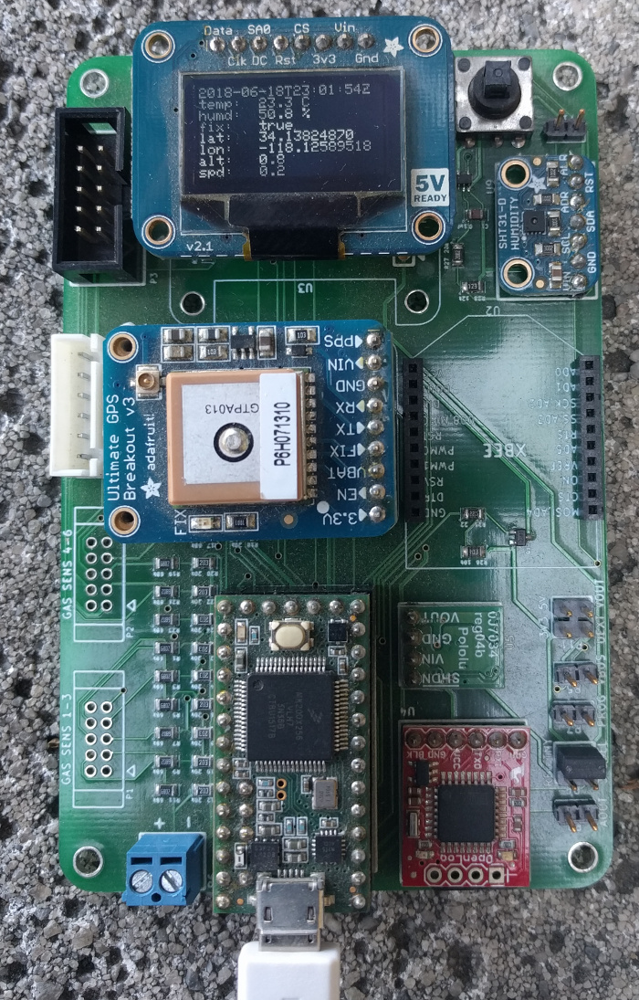

## sht31_gps_logger  

Firmware for teensy 3.2 based data logger which records temperature, humidity
and (GPS) location data. Uses the Adafruit SHT31 temperature and humidity
sensor, Adafruit Ultimate GPS, and Sparkfun open log data logger. 

